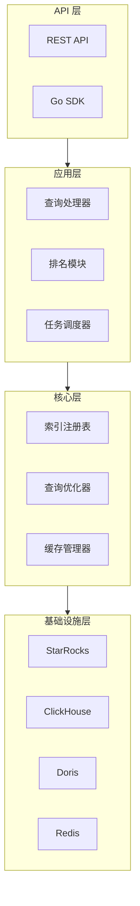

# StarSeek

面向现代数据仓库和数据湖的高性能企业级全文检索中台服务，主要支持 StarRocks、ClickHouse 和 Apache Doris。

[English Documentation](README.md) | [架构文档](docs/architecture.md)

## 项目概述

StarSeek 通过提供统一的全文检索层，弥合了传统 OLAP 数据库与现代搜索需求之间的鸿沟。它充分利用底层数据仓库的倒排索引，同时增加了排名、高亮显示和跨表查询等高级搜索功能。

### 核心痛点解决

- **搜索体验碎片化**：不同表和列的倒排索引分散在各个数据库中
- **搜索能力受限**：OLAP 数据库缺乏相关性评分和高亮显示等高级搜索功能
- **性能瓶颈**：大型 UNION ALL 查询导致性能下降
- **维护复杂性**：跨多表手动管理搜索元数据

### 核心价值主张

- **统一搜索接口**：多表、多列全文检索的单一 API 端点
- **高级搜索功能**：TF-IDF 评分、分页、高亮显示、同义词扩展
- **高性能**：位图优化、Redis 缓存和并发查询执行
- **多数据库支持**：StarRocks（主要）、ClickHouse 和 Apache Doris 兼容
- **企业就绪**：内置可观测性、错误处理和水平扩展能力

## 功能特性

### 核心能力

- **索引注册表管理**：所有倒排索引的集中式元数据管理
- **多语言支持**：中文/英文/多语言分词，匹配数据库策略
- **跨表搜索**：同时查询多个表和列
- **高级排名**：TF-IDF 和类 BM25 评分算法
- **查询优化**：位图过滤、结果缓存和热词预加载
- **并发处理**：带流控的任务调度，避免大型 SQL 联合查询

### 搜索 API 示例

```bash
# 跨多字段基本搜索
GET /api/v1/search?q=人工智能&fields=title,content&limit=10&offset=0

# 高级字段特定搜索
GET /api/v1/search?q=title:技术 AND content:创新&highlight=true

# 多数据库搜索
GET /api/v1/search?q=machine learning&databases=starrocks,clickhouse
````

### Go SDK 示例

```go
package main

import (
    "context"
    "fmt"
    "log"
    
    "github.com/turtacn/starseek/pkg/client"
)

func main() {
    // 初始化 StarSeek 客户端
    client := starseek.NewClient(&starseek.Config{
        Endpoint: "http://localhost:8080",
        APIKey:   "your-api-key",
    })
    
    // 执行搜索
    ctx := context.Background()
    result, err := client.Search(ctx, &starseek.SearchRequest{
        Query:     "人工智能",
        Fields:    []string{"title", "content"},
        Limit:     10,
        Highlight: true,
    })
    
    if err != nil {
        log.Fatal(err)
    }
    
    fmt.Printf("找到 %d 个结果，耗时 %dms\n", result.Total, result.Took)
    for _, hit := range result.Hits {
        fmt.Printf("评分: %.2f, 表: %s, ID: %s\n", 
            hit.Score, hit.Table, hit.ID)
    }
}
```

## 架构概览

StarSeek 遵循分层架构，职责分离清晰：



详细架构信息请参阅[架构文档](docs/architecture.md)。

## 快速开始

### 前置要求

* Go 1.20.2+
* Redis 6.0+
* 以下之一：StarRocks 3.0+、ClickHouse 22.0+、Apache Doris 2.0+

### 安装

```bash
# 克隆仓库
git clone https://github.com/turtacn/starseek.git
cd starseek

# 构建项目
make build

# 使用默认配置运行
./bin/starseek server --config config/server.yaml
```

### 配置

```yaml
# config/server.yaml
server:
  host: "0.0.0.0"
  port: 8080
  
databases:
  starrocks:
    host: "localhost"
    port: 9030
    username: "root"
    password: ""
    
redis:
  host: "localhost"
  port: 6379
  
logging:
  level: "info"
  format: "json"
```

### Docker 部署

```bash
# 使用 Docker Compose
docker-compose up -d

# 或手动构建和运行
docker build -t starseek:latest .
docker run -p 8080:8080 -v $(pwd)/config:/app/config starseek:latest
```

## API 文档

### 搜索端点

```http
GET /api/v1/search
```

**参数:**

| 参数        | 类型        | 必需 | 描述             |
| --------- | --------- | -- | -------------- |
| q         | string    | 是  | 搜索查询           |
| fields    | string\[] | 否  | 搜索字段           |
| databases | string\[] | 否  | 目标数据库          |
| limit     | int       | 否  | 每页结果数（默认：10）   |
| offset    | int       | 否  | 分页偏移（默认：0）     |
| highlight | bool      | 否  | 启用高亮（默认：false） |

**响应:**

```json
{
  "took": 15,
  "total": 1245,
  "hits": [
    {
      "score": 0.95,
      "table": "documents",
      "id": "doc_123",
      "fields": {
        "title": "人工智能技术发展",
        "content": "AI技术正在快速发展..."
      },
      "highlight": {
        "title": ["<em>人工智能</em>技术发展"]
      }
    }
  ]
}
```

## 开发

### 从源码构建

```bash
# 安装依赖
go mod download

# 运行测试
make test

# 构建二进制文件
make build

# 本地运行
make run
```

### 测试

```bash
# 单元测试
go test ./...

# 集成测试
make test-integration

# 基准测试
make benchmark
```

## 贡献

我们欢迎贡献！详情请参阅[贡献指南](CONTRIBUTING.md)。

### 开发环境设置

1. Fork 仓库
2. 创建功能分支：`git checkout -b feature/amazing-feature`
3. 提交更改：`git commit -m 'Add amazing feature'`
4. 推送到分支：`git push origin feature/amazing-feature`
5. 打开 Pull Request

### 代码标准

* 遵循 Go 最佳实践和[Effective Go](https://golang.org/doc/effective_go.html)
* 为新功能编写全面的测试
* 为 API 变更更新文档
* 使用约定式提交消息

## 许可证

本项目基于 Apache License 2.0 许可证 - 详情请参阅[LICENSE](LICENSE)文件。

## 支持

* **问题反馈**：[GitHub Issues](https://github.com/turtacn/starseek/issues)
* **讨论**：[GitHub Discussions](https://github.com/turtacn/starseek/discussions)
* **文档**：[docs/](docs/)

## 路线图

* [ ] 向量搜索集成
* [ ] 实时索引更新
* [ ] 多租户支持
* [ ] Kubernetes operator
* [ ] Web UI 仪表板

---

⭐ 如果您觉得 StarSeek 有用，请在 GitHub 上给我们一个星标！