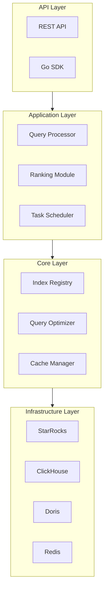

# StarSeek

A high-performance, enterprise-grade full-text search middleware service designed for modern data warehouses and data lakes, with primary support for StarRocks, ClickHouse, and Apache Doris.

[中文文档](README-zh.md) | [Architecture](docs/architecture.md)

## Overview

StarSeek bridges the gap between traditional OLAP databases and modern search requirements by providing a unified full-text search layer. It leverages inverted indexes from underlying data warehouses while adding advanced search capabilities like ranking, highlighting, and cross-table queries.

### Core Pain Points Addressed

- **Fragmented Search Experience**: Different tables and columns with inverted indexes scattered across databases
- **Limited Search Capabilities**: OLAP databases lack advanced search features like relevance scoring and highlighting
- **Performance Bottlenecks**: Large UNION ALL queries causing performance degradation
- **Maintenance Complexity**: Manual management of search metadata across multiple tables

### Key Value Propositions

- **Unified Search Interface**: Single API endpoint for multi-table, multi-column full-text search
- **Advanced Search Features**: TF-IDF scoring, pagination, highlighting, synonym expansion
- **High Performance**: Bitmap optimization, Redis caching, and concurrent query execution
- **Multi-Database Support**: StarRocks (primary), ClickHouse, and Apache Doris compatibility
- **Enterprise Ready**: Built-in observability, error handling, and horizontal scalability

## Features

### Core Capabilities

- **Index Registry Management**: Centralized metadata management for all inverted indexes
- **Multi-Language Support**: Chinese/English/Multi-language tokenization matching database strategies
- **Cross-Table Search**: Query across multiple tables and columns simultaneously
- **Advanced Ranking**: TF-IDF and BM25-like scoring algorithms
- **Query Optimization**: Bitmap filtering, result caching, and hot keyword preloading
- **Concurrent Processing**: Task scheduling with flow control instead of large SQL unions

### Search API Example

```bash
# Basic search across multiple fields
GET /api/v1/search?q=人工智能&fields=title,content&limit=10&offset=0

# Advanced field-specific search
GET /api/v1/search?q=title:技术 AND content:创新&highlight=true

# Multi-database search
GET /api/v1/search?q=machine learning&databases=starrocks,clickhouse
````

### Go SDK Example

```go
package main

import (
    "context"
    "fmt"
    "log"
    
    "github.com/turtacn/starseek/pkg/client"
)

func main() {
    // Initialize StarSeek client
    client := starseek.NewClient(&starseek.Config{
        Endpoint: "http://localhost:8080",
        APIKey:   "your-api-key",
    })
    
    // Perform search
    ctx := context.Background()
    result, err := client.Search(ctx, &starseek.SearchRequest{
        Query:     "人工智能",
        Fields:    []string{"title", "content"},
        Limit:     10,
        Highlight: true,
    })
    
    if err != nil {
        log.Fatal(err)
    }
    
    fmt.Printf("Found %d results in %dms\n", result.Total, result.Took)
    for _, hit := range result.Hits {
        fmt.Printf("Score: %.2f, Table: %s, ID: %s\n", 
            hit.Score, hit.Table, hit.ID)
    }
}
```

## Architecture Overview

StarSeek follows a layered architecture with clear separation of concerns:



For detailed architecture information, see [Architecture Documentation](docs/architecture.md).

## Quick Start

### Prerequisites

* Go 1.20.2+
* Redis 6.0+
* One of: StarRocks 3.0+, ClickHouse 22.0+, Apache Doris 2.0+

### Installation

```bash
# Clone the repository
git clone https://github.com/turtacn/starseek.git
cd starseek

# Build the project
make build

# Run with default configuration
./bin/starseek server --config config/server.yaml
```

### Configuration

```yaml
# config/server.yaml
server:
  host: "0.0.0.0"
  port: 8080
  
databases:
  starrocks:
    host: "localhost"
    port: 9030
    username: "root"
    password: ""
    
redis:
  host: "localhost"
  port: 6379
  
logging:
  level: "info"
  format: "json"
```

### Docker Deployment

```bash
# Using Docker Compose
docker-compose up -d

# Or build and run manually
docker build -t starseek:latest .
docker run -p 8080:8080 -v $(pwd)/config:/app/config starseek:latest
```

## API Documentation

### Search Endpoint

```http
GET /api/v1/search
```

**Parameters:**

| Parameter | Type      | Required | Description                          |
| --------- | --------- | -------- | ------------------------------------ |
| q         | string    | Yes      | Search query                         |
| fields    | string\[] | No       | Fields to search in                  |
| databases | string\[] | No       | Target databases                     |
| limit     | int       | No       | Results per page (default: 10)       |
| offset    | int       | No       | Pagination offset (default: 0)       |
| highlight | bool      | No       | Enable highlighting (default: false) |

**Response:**

```json
{
  "took": 15,
  "total": 1245,
  "hits": [
    {
      "score": 0.95,
      "table": "documents",
      "id": "doc_123",
      "fields": {
        "title": "人工智能技术发展",
        "content": "AI技术正在快速发展..."
      },
      "highlight": {
        "title": ["<em>人工智能</em>技术发展"]
      }
    }
  ]
}
```

## Development

### Building from Source

```bash
# Install dependencies
go mod download

# Run tests
make test

# Build binary
make build

# Run locally
make run
```

### Testing

```bash
# Unit tests
go test ./...

# Integration tests
make test-integration

# Benchmark tests
make benchmark
```

## Contributing

We welcome contributions! Please see our [Contributing Guide](CONTRIBUTING.md) for details.

### Development Setup

1. Fork the repository
2. Create a feature branch: `git checkout -b feature/amazing-feature`
3. Commit your changes: `git commit -m 'Add amazing feature'`
4. Push to the branch: `git push origin feature/amazing-feature`
5. Open a Pull Request

### Code Standards

* Follow Go best practices and [Effective Go](https://golang.org/doc/effective_go.html)
* Write comprehensive tests for new features
* Update documentation for API changes
* Use conventional commit messages

## License

This project is licensed under the Apache License 2.0 - see the [LICENSE](LICENSE) file for details.

## Support

* **Issues**: [GitHub Issues](https://github.com/turtacn/starseek/issues)
* **Discussions**: [GitHub Discussions](https://github.com/turtacn/starseek/discussions)
* **Documentation**: [docs/](docs/)

## Roadmap

* [ ] Vector search integration
* [ ] Real-time index updates
* [ ] Multi-tenant support
* [ ] Kubernetes operator
* [ ] Web UI dashboard

---

⭐ If you find StarSeek helpful, please give us a star on GitHub!