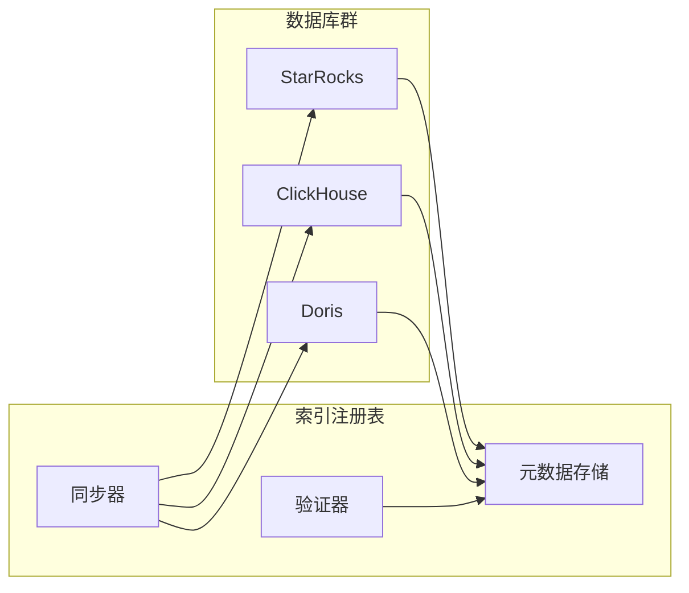
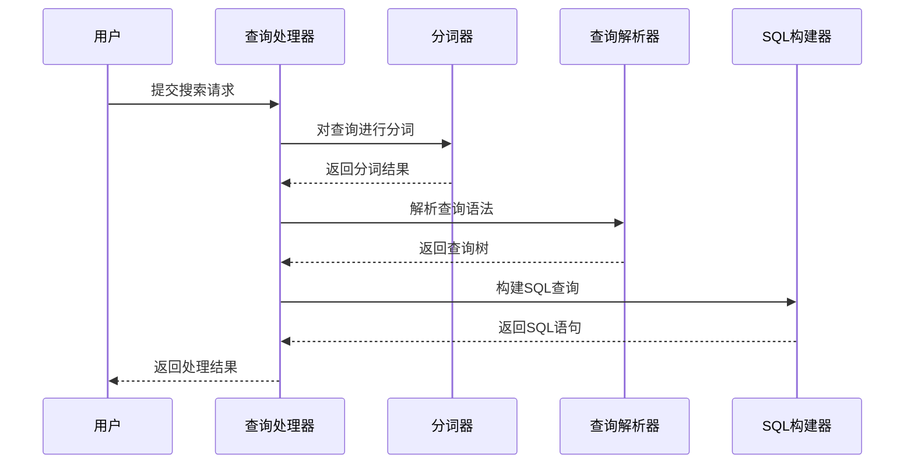
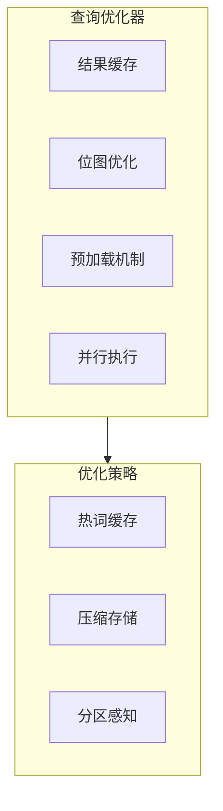
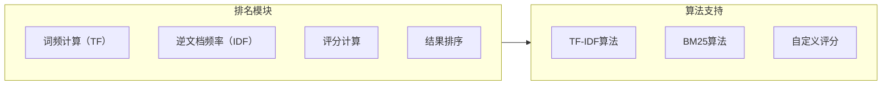
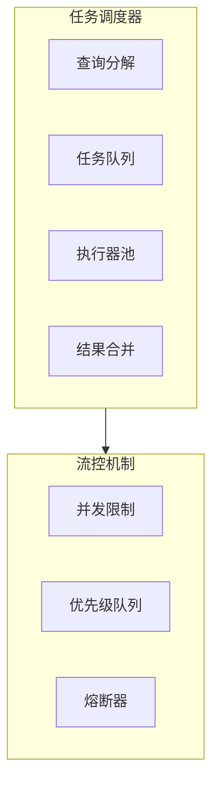
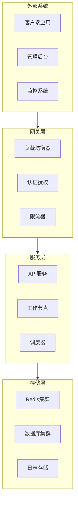
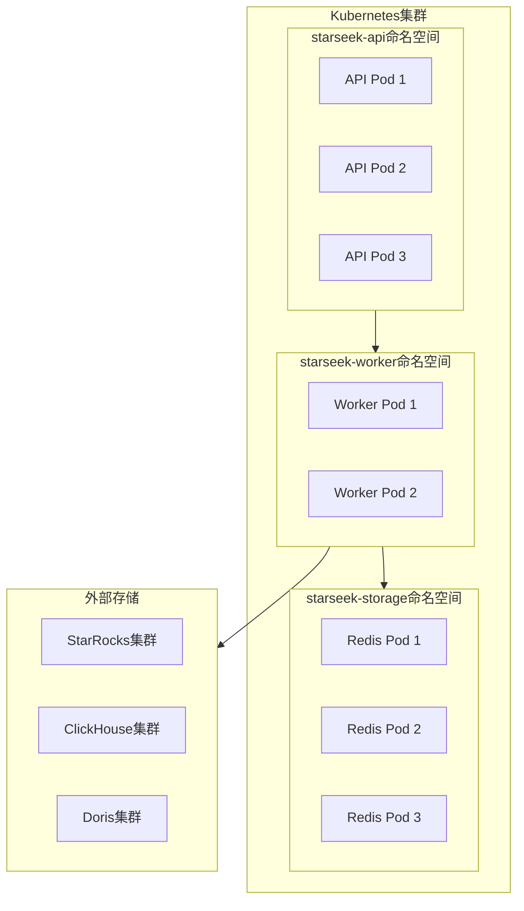
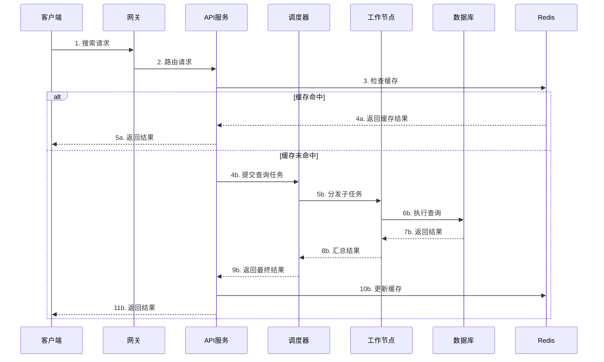

# StarSeek 架构设计文档

## 概述

StarSeek 是一个高性能、企业级的全文检索中台服务，专门为现代数据仓库和数据湖环境设计。本文档详细阐述了 StarSeek 的架构设计理念、技术选型、模块划分以及实现细节。

## 领域问题全景分析

### 1. 传统OLAP数据库全文检索局限性

现代数据仓库如 StarRocks、ClickHouse、Apache Doris 虽然在分析查询方面表现优异，但在全文检索领域存在显著局限：

- **索引管理分散化**：各表的倒排索引配置分散，缺乏统一管理机制
- **搜索功能受限**：缺乏现代搜索引擎的高级功能（相关性评分、高亮显示、同义词扩展）
- **跨表查询复杂**：需要复杂的 UNION ALL 语句，影响查询性能
- **分词策略不一致**：不同表可能使用不同的分词策略，导致搜索结果不一致

### 2. 企业级搜索需求挑战

- **多租户隔离**：不同业务线需要独立的搜索空间
- **实时性要求**：数据更新后需要快速反映在搜索结果中
- **高并发处理**：需要支持大量并发搜索请求
- **可观测性需求**：需要详细的监控、日志和追踪机制

## 解决方案全景

### 1. 核心设计理念

StarSeek 采用"中台化"思维，将全文检索能力从各个业务系统中抽象出来，形成统一的服务层：

```mermaid
graph TB
    subgraph BL[业务层（Business Layer）]
        App1[应用系统1]
        App2[应用系统2]
        App3[应用系统3]
    end
    
    subgraph ML[中台层（Middleware Layer）]
        SS[StarSeek 检索中台]
    end
    
    subgraph DL[数据层（Data Layer）]
        SR[StarRocks集群]
        CH[ClickHouse集群]
        DR[Doris集群]
    end
    
    App1 --> SS
    App2 --> SS
    App3 --> SS
    SS --> SR
    SS --> CH
    SS --> DR
````

### 2. 分层架构设计

StarSeek 采用经典的分层架构模式，确保各层职责清晰、松耦合：

```mermaid
graph TB
    subgraph PL[展现层（Presentation Layer）]
        REST[REST API服务]
        SDK[Go SDK客户端]
        WEB[Web管理界面]
    end
    
    subgraph AL[应用层（Application Layer）]
        QP[查询处理器（Query Processor）]
        RM[排名模块（Ranking Module）]
        TS[任务调度器（Task Scheduler）]
        AM[API管理器（API Manager）]
    end
    
    subgraph DL[领域层（Domain Layer）]
        IR[索引注册表（Index Registry）]
        QO[查询优化器（Query Optimizer）]
        SE[搜索引擎（Search Engine）]
        CM[缓存管理器（Cache Manager）]
    end
    
    subgraph IL[基础设施层（Infrastructure Layer）]
        DB[数据库适配器]
        CACHE[缓存适配器]
        LOG[日志系统]
        METRIC[指标收集]
    end
    
    PL --> AL
    AL --> DL
    DL --> IL
```

### 3. 核心模块详细设计

#### 3.1 索引注册表模块（Index Registry）

索引注册表是整个系统的元数据中心，负责管理所有数据库表的索引信息：



**核心功能：**

* 自动发现和注册倒排索引配置
* 维护表结构和字段类型信息
* 管理分词策略和索引类型映射
* 提供索引健康检查和验证机制

#### 3.2 查询处理模块（Query Processor）

查询处理器负责将用户的自然语言查询转换为可执行的数据库查询：



**关键特性：**

* 多语言分词支持（中文、英文、多语言）
* 查询语法解析（支持 AND、OR、NOT 逻辑）
* 字段特定查询（如 title:关键词）
* 同义词扩展和查询重写

#### 3.3 查询优化模块（Query Optimizer）

查询优化器通过多种策略提升查询性能：



**优化策略：**

* Redis 缓存热门查询结果
* 位图（Bitmap）加速行号过滤
* 预加载高频关键词的倒排索引
* 智能查询计划选择

#### 3.4 排名模块（Ranking Module）

由于底层 OLAP 数据库缺乏相关性评分能力，排名模块在应用层实现类似 Elasticsearch 的评分机制：



**评分机制：**

* TF-IDF 经典算法实现
* BM25 改进算法支持
* 可插拔的自定义评分函数
* 字段权重和提升因子

#### 3.5 任务调度模块（Task Scheduler）

任务调度器将大型跨表查询分解为并发的单表查询任务：



**核心能力：**

* 智能查询分解策略
* 可配置的并发度控制
* 优先级队列支持
* 熔断和降级机制

## 技术架构详细设计

### 1. 系统架构图



### 2. 部署架构图



### 3. 数据流程图



## 预期效果与技术指标

### 1. 性能指标

| 指标     | 目标值           | 说明          |
| ------ | ------------- | ----------- |
| 查询响应时间 | < 100ms (P95) | 单表查询平均响应时间  |
| 跨表查询时间 | < 500ms (P95) | 5张表联合查询响应时间 |
| 并发支持   | 1000+ QPS     | 单节点查询处理能力   |
| 缓存命中率  | > 80%         | 热门查询缓存命中率   |
| 索引同步延迟 | < 10s         | 元数据同步延迟     |

### 2. 可用性指标

| 指标     | 目标值    | 说明       |
| ------ | ------ | -------- |
| 系统可用性  | 99.9%  | 年度系统可用性  |
| 故障恢复时间 | < 5min | 平均故障恢复时间 |
| 数据一致性  | 99.99% | 索引数据一致性  |

### 3. 扩展性指标

| 指标     | 目标值      | 说明            |
| ------ | -------- | ------------- |
| 支持表数量  | 10,000+  | 单集群支持的表数量     |
| 支持索引列数 | 100,000+ | 单集群支持的索引列数    |
| 水平扩展能力 | 线性扩展     | 节点数量与处理能力线性关系 |