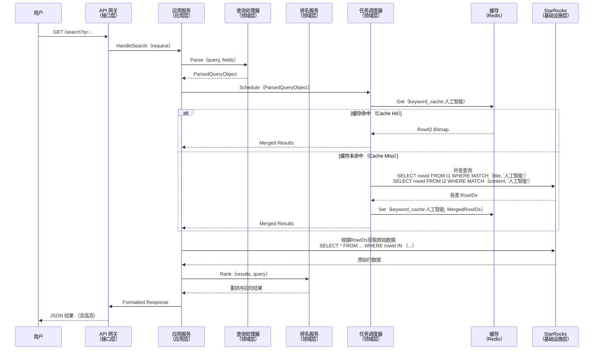

# Starseek 项目架构设计文档

## 1. 引言

### 1.1. 项目背景

随着数据量的爆炸式增长，企业越来越依赖于像 StarRocks、Apache Doris 和 ClickHouse 这样的高性能分析型数据库（OLAP）来进行海量数据的实时分析。这些系统内置了基础的全文检索能力（如倒排索引），解决了从无到有的问题。然而，与专业的搜索引擎 Elasticsearch 相比，它们在检索功能的丰富性、易用性和统一管理方面存在显著差距，例如缺乏复杂的相关度排序、便捷的跨表查询接口、高亮显示和统一的索引生命周期管理。

### 1.2. 项目愿景

**Starseek** 旨在成为一个构建在现代 OLAP 数据仓库之上的、轻量级、高性能的 **全文检索中台服务**。它并非要替代底层数据仓库，而是作为其能力的“增强适配层”和“智能查询网关”。

我们的目标是：
* **对上**：为业务方提供统一、强大且类 Elasticsearch 体验的搜索 API。
* **对下**：智能、高效地利用 StarRocks 等数据仓库的现有能力，将复杂的搜索请求翻译为优化的、并发执行的 SQL 查询。

通过 Starseek，开发者可以近乎零成本地为已存储在数据仓库中的海量数据赋予强大的全文检索能力，而无需维护一个独立、昂贵的 Elasticsearch 集群。

## 2. 设计原则与目标

本项目严格遵循以下核心设计原则：

* **分层与模块化**：采用清晰的四层架构，确保高内聚、低耦合。
* **借鉴与创新**：吸收 Elasticsearch 的优秀设计，并结合 OLAP 引擎的特性进行创新。
* **端到端价值导向**：所有设计都直接映射到最终用户价值，提供清晰的接口和稳定的性能。
* **可测试性 (Testability)**：架构设计高度关注单元、集成和端到端测试的便捷性。
* **可观测性 (Observability)**：内置日志、指标和追踪，实现无死角监控。
* **可靠性与容错性 (Reliability & Fault Tolerance)**：集中的错误处理和容错机制。
* **高性能与可伸缩性 (High Performance & Scalability)**：系统需支持水平扩展，核心流程追求极致性能。

## 3. DFX 全景分析 (Design for X)

* **可靠性 (Reliability)**：通过任务调度模块的并发控制和熔断机制，避免对底层数据库造成冲击。关键元数据和缓存使用 Redis 等成熟组件保证高可用。
* **可伸缩性 (Scalability)**：Starseek 服务本身设计为无状态，可以水平扩展部署多个实例。通过外部缓存（Redis）共享状态，通过负载均衡器分发流量。
* **可测试性 (Testability)**：基于接口的编程和依赖注入，使得各模块可以独立进行单元测试。核心的查询转换逻辑将有独立的测试用例集。
* **可观测性 (Observability)**：集成的日志框架（如 Zap）、通过 Prometheus 暴露核心指标（QPS、延迟、缓存命中率），并计划支持 OpenTelemetry 进行分布式追踪。

## 4. 系统架构

### 4.1. 逻辑架构图 (Logical Architecture)

系统采用经典的四层领域驱动设计（DDD）分层架构，确保职责清晰、易于维护。

```mermaid
graph TD
    subgraph A[接口层（Interface Layer）]
        direction LR
        API[RESTful API <br/> （Gin Framework）]
        CLI[命令行工具（CLI）]
    end

    subgraph B[应用层（Application Layer）]
        direction LR
        SearchApp[搜索应用服务 <br/> （Search Service）]
        IndexApp[索引管理应用服务 <br/> （Index Registry Service）]
    end

    subgraph C[领域层（Domain Layer）]
        direction LR
        subgraph Models [领域模型]
            M1[索引元数据 <br/> （IndexMetadata）]
            M2[查询对象 <br/> （Query）]
            M3[搜索结果 <br/> （SearchResult）]
        end
        subgraph Services [领域服务]
            S1[查询处理器 <br/> （Query Processor）]
            S2[排名服务 <br/> （Ranking Service）]
            S3[任务调度器 <br/> （Task Scheduler）]
        end
        subgraph Repos [仓储接口]
            R1[索引元数据仓储 <br/> （IndexMetadataRepository）]
            R2[搜索仓储 <br/> （SearchRepository）]
        end
    end

    subgraph D[基础设施层（Infrastructure Layer）]
        direction LR
        subgraph DBAdapter [数据库适配器]
            Adpt1[StarRocks 适配器]
            Adpt2[Doris 适配器]
            Adpt3[ClickHouse 适配器]
        end
        subgraph InfraImpl [基础设施实现]
            Cache[缓存服务 <br/> （Redis）]
            Log[日志服务 <br/> （Zap）]
            Persistence[持久化实现 <br/> （GORM/sqlx）]
        end
    end

    %% 依赖关系
    A -- 调用 --> B
    B -- 调用 --> C
    C -- 依赖接口 --> D

    classDef layer fill:#f9f9f9,stroke:#333,stroke-width:2px;
    class A,B,C,D layer;
````

**架构解读**：

  * **接口层**: 对外暴露服务的入口，目前规划为 RESTful API。它负责解析 HTTP 请求，调用应用层服务，并格式化返回结果。
  * **应用层**: 负责编排领域服务和仓储接口，处理用例流程，如参数校验、事务控制、权限验证等。它是连接用户请求和核心业务逻辑的桥梁。
  * **领域层**: 包含项目的核心业务逻辑。领域模型定义了业务实体；领域服务实现了核心算法（如查询解析、评分）；仓储接口定义了数据访问的契约。
  * **基础设施层**: 提供所有技术实现，如数据库连接、缓存读写、日志记录等。它实现了领域层定义的仓储接口，并通过适配器模式兼容多种数据源。

### 4.2. 部署架构图 (Deployment Architecture)

下图展示了 Starseek 在生产环境中的典型部署模式。

```mermaid
graph TD
    subgraph "用户端（Clients）"
        User[用户/业务应用]
    end

    subgraph "基础设施（Infrastructure）"
        LB[负载均衡器 <br/> （Nginx/SLB）]
        subgraph "Starseek 服务集群"
            S1[Starseek 实例 1]
            S2[Starseek 实例 2]
            S3[Starseek 实例 N]
        end
        Redis[Redis 集群 <br/> （缓存/任务队列）]
    end
    
    subgraph "数据仓库（Data Warehouse）"
        SR[StarRocks 集群]
        DR[（可选）Doris 集群]
        CH[（可选）ClickHouse 集群]
    end

    User --> LB
    LB --> S1
    LB --> S2
    LB --> S3

    S1 <--> Redis
    S2 <--> Redis
    S3 <--> Redis

    S1 <--> SR
    S2 <--> SR
    S3 <--> SR
    
    S1 -.-> DR
    S1 -.-> CH
    
    style S1 fill:#cde4ff,stroke:#6495ED
    style S2 fill:#cde4ff,stroke:#6495ED
    style S3 fill:#cde4ff,stroke:#6495ED
```

**部署解读**：

1.  **高可用**: Starseek 服务是无状态的，可以部署多个实例并通过负载均衡器对外提供服务，实现高可用和水平扩展。
2.  **状态分离**: 关键的运行时状态，如索引元数据缓存、热门关键词的倒排结果缓存，都存储在外部的 Redis 集群中，供所有 Starseek 实例共享。
3.  **数据交互**: 所有 Starseek 实例直接连接后端的 StarRocks 集群（或其他数据仓库）来执行查询。

### 4.3. 核心流程：统一搜索查询

以下时序图展示了处理一个典型搜索请求 `GET /search?q=人工智能&fields=title,content` 的完整流程。



## 5\. 与 Elasticsearch 的对比分析

| 维度 | Starseek + StarRocks 方案 | Elasticsearch 方案 | 分析与权衡 |
| :--- | :--- | :--- | :--- |
| **资源开销** | **低**。复用现有数据仓库，仅增加无状态计算层和轻量级缓存（Redis）。 | **高**。需要独立的 ES 集群（Master/Data/Ingest 节点），存储双份数据，消耗大量内存和磁盘。 | Starseek 方案在资源成本上优势巨大，尤其适合数据已在 OLAP 中的场景。 |
| **全文检索性能** | **中到高**。依赖 StarRocks 的倒排索引性能。对于复杂查询，应用层处理有额外开销。 | **非常高**。专为搜索设计，基于 Lucene，查询性能和功能极为强大。 | ES 在纯粹的、复杂的全文检索场景下性能更优。Starseek 足以满足绝大多数常规搜索需求。 |
| **数据同步** | **无延迟**。直接查询原始数据，无需 ETL 同步，保证了数据的绝对实时性。 | **近实时**。需要通过 Logstash/Flink 等工具将数据从源端同步至 ES，存在秒级到分钟级的延迟。 | Starseek 在数据实时性上完胜，消除了数据同步的复杂性和维护成本。 |
| **相关度排序** | **基础/可模拟**。原生支持有限，可在应用层模拟 TF-IDF，但有性能开销。 | **高级**。原生支持 TF-IDF、BM25 等多种复杂评分算法，可高度定制。 | ES 在搜索相关性方面是黄金标准。Starseek 的目标是提供“足够好”的排序。 |
| **运维复杂度** | **低**。只需维护无状态的 Golang 应用和 Redis，技术栈简单。 | **高**。需要专业的 ES 运维经验，涉及集群管理、索引优化、版本升级等。 | Starseek 方案极大降低了运维负担。 |
| **总结** | 适合**数据已在 OLAP 系统**中，对**搜索相关度要求非极致**，但对**资源成本和数据实时性敏感**的场景。 | 适合**以搜索为核心业务**，需要**高级相关度排序和复杂聚合分析**，且**能接受独立集群和数据同步开销**的场景。 |

## 6\. 未来展望

  * **高级评分模型**: 引入 BM25 算法的模拟实现，并探索利用 StarRocks UDF 的可能性以提升性能。
  * **向量检索支持**: 随着 StarRocks 等系统对向量索引的支持，Starseek 可扩展为统一的混合（全文+向量）检索网关。
  * **多源异构查询**: 实现真正的跨数据源查询，例如将 StarRocks 的一张表和 ClickHouse 的一张表进行联合搜索。
  * **智能化建议**: 基于查询日志，提供搜索词自动补全、拼写纠错等高级功能。

## 7\. 参考资料

* [1] StarRocks Official Documentation. https://docs.starrocks.io/
* [2] Elasticsearch Guide. https://www.elastic.co/guide/en/elasticsearch/reference/current/index.html
* [3] Domain-Driven Design Distilled by Vaughn Vernon.