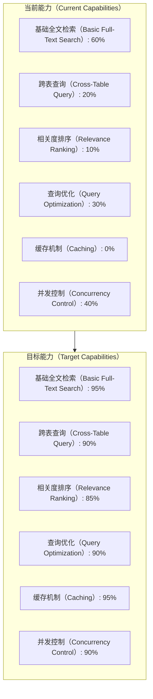
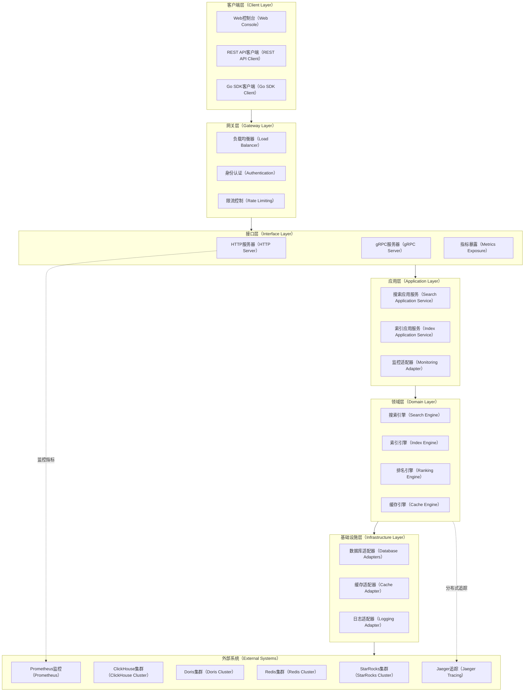
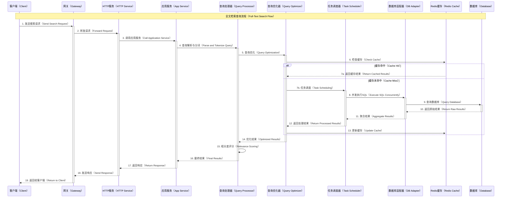
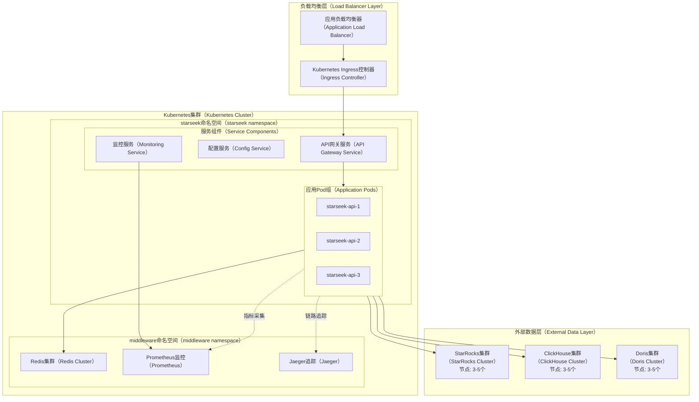
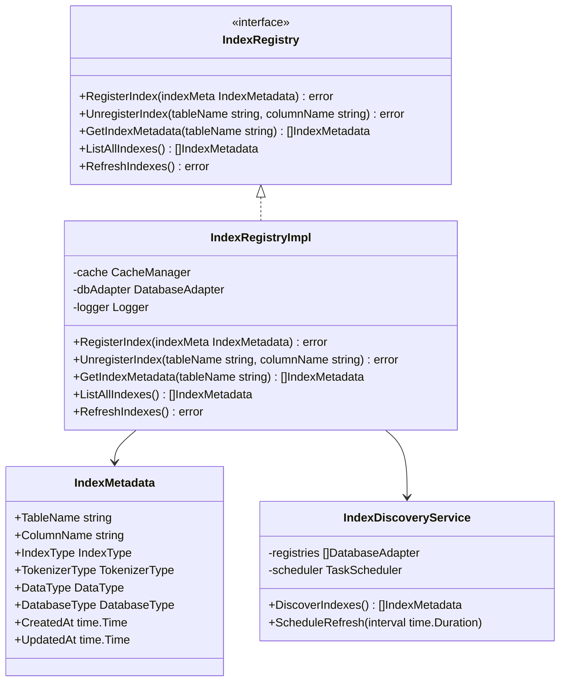
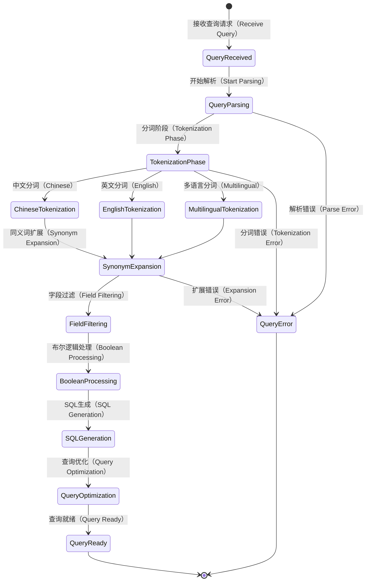
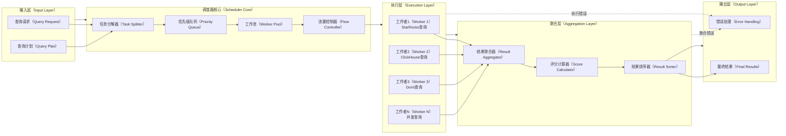
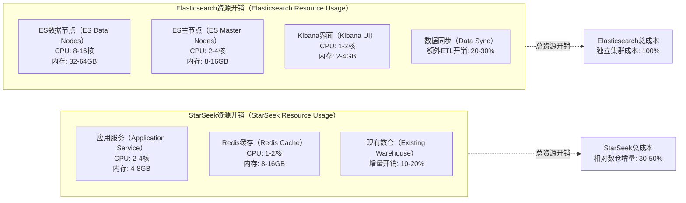

# StarSeek 架构设计文档

## 1. 领域问题全景分析

### 1.1 数据仓库全文检索领域现状

在现代数据驱动的企业环境中，数据仓库承载着海量的结构化和半结构化数据。随着业务复杂度的提升，传统的精确查询已无法满足灵活的数据检索需求，全文检索能力成为数据仓库的重要补充。

#### 1.1.1 技术挑战矩阵

| 挑战维度 | StarRocks | ClickHouse | Doris | 影响程度 |
|---------|-----------|------------|-------|----------|
| 倒排索引管理 | 分散化，无统一接口 | 手动维护复杂 | 索引元信息缺失 | 🔴 高 |
| 跨表检索能力 | 需手写复杂SQL | UNION ALL性能差 | 缺乏统一查询层 | 🔴 高 |
| 相关度评分 | 无内置TF-IDF | 算法实现困难 | 排序能力有限 | 🟡 中 |
| 查询优化 | 列存扫描开销大 | 缓存机制不足 | 并发控制缺失 | 🟡 中 |
| 多语言分词 | 分词策略不统一 | 中文支持有限 | 分词器扩展困难 | 🟢 低 |

#### 1.1.2 业务需求痛点

```mermaid
graph TD
    %% 业务痛点分析图
    subgraph BP[业务痛点（Business Pain Points）]
        A1[数据孤岛（Data Silos）] --> A2[检索效率低下（Low Search Efficiency）]
        A3[运维成本高（High Operational Cost）] --> A4[开发复杂度大（High Development Complexity）]
        A5[用户体验差（Poor UX）] --> A6[业务价值受限（Limited Business Value）]
    end

    subgraph TP[技术痛点（Technical Pain Points）]
        B1[索引管理分散（Fragmented Index Management）]
        B2[查询语法复杂（Complex Query Syntax）]
        B3[性能瓶颈明显（Performance Bottlenecks）]
        B4[缓存机制缺失（Missing Cache Layer）]
        B5[监控能力不足（Insufficient Monitoring）]
    end

    BP --> TP
    A1 --> B1
    A2 --> B2
    A4 --> B3
    A3 --> B4
    A6 --> B5
````

### 1.2 解决方案全景设计

#### 1.2.1 架构设计理念

StarSeek 采用**领域驱动设计（DDD）**结合**六边形架构**的设计理念，构建高内聚、低耦合的全文检索中台服务。

```mermaid
graph TB
    %% 六边形架构图
    subgraph HEX[六边形架构（Hexagonal Architecture）]
        subgraph CORE[核心领域（Core Domain）]
            DOM[领域模型（Domain Models）]
            SVC[领域服务（Domain Services）]
            REPO[仓储接口（Repository Interfaces）]
        end

        subgraph APP[应用层（Application Layer）]
            AS[应用服务（Application Services）]
            QH[查询处理器（Query Handlers）]
            CMD[命令处理器（Command Handlers）]
        end

        subgraph PORTS[端口层（Ports）]
            IAPI[入站端口（Inbound Ports）]
            OAPI[出站端口（Outbound Ports）]
        end

        subgraph ADAPTERS[适配器层（Adapters）]
            HTTP[HTTP适配器（HTTP Adapter）]
            GRPC[gRPC适配器（gRPC Adapter）]
            DB[数据库适配器（Database Adapters）]
            CACHE[缓存适配器（Cache Adapter）]
        end
    end

    %% 连接关系
    HTTP --> IAPI
    GRPC --> IAPI
    IAPI --> AS
    AS --> SVC
    SVC --> DOM
    SVC --> OAPI
    OAPI --> DB
    OAPI --> CACHE
    
    %% 外部系统
    CLIENT[客户端应用（Client Applications）] --> HTTP
    SDK[Go SDK] --> GRPC
    SR[StarRocks] --> DB
    CH[ClickHouse] --> DB
    DORIS[Apache Doris] --> DB
    REDIS[Redis Cache] --> CACHE
```

#### 1.2.2 核心模块设计

```mermaid
graph LR
    %% 核心模块关系图
    subgraph REGISTRY[索引注册表模块（Index Registry Module）]
        IR1[元信息管理（Metadata Management）]
        IR2[索引发现（Index Discovery）]
        IR3[配置同步（Configuration Sync）]
    end

    subgraph PROCESSOR[查询处理模块（Query Processor Module）]
        QP1[分词处理（Tokenization）]
        QP2[查询解析（Query Parsing）]
        QP3[SQL生成（SQL Generation）]
    end

    subgraph OPTIMIZER[查询优化模块（Query Optimizer Module）]
        OPT1[缓存管理（Cache Management）]
        OPT2[并发控制（Concurrency Control）]
        OPT3[位图过滤（Bitmap Filtering）]
    end

    subgraph RANKING[排名模块（Ranking Module）]
        RK1[TF-IDF计算（TF-IDF Computation）]
        RK2[相关度评分（Relevance Scoring）]
        RK3[结果排序（Result Sorting）]
    end

    subgraph SCHEDULER[任务调度模块（Task Scheduler Module）]
        SCH1[并发执行（Concurrent Execution）]
        SCH2[流量控制（Flow Control）]
        SCH3[故障处理（Fault Handling）]
    end

    %% 模块间依赖关系
    REGISTRY --> PROCESSOR
    PROCESSOR --> OPTIMIZER
    PROCESSOR --> SCHEDULER
    SCHEDULER --> RANKING
    OPTIMIZER --> RANKING
```



### 1.3 预期效果全景

#### 1.3.1 性能提升预期

| 指标维度   | 现状基线       | 预期目标           | 提升幅度          |
| ------ | ---------- | -------------- | ------------- |
| 查询响应时间 | 500ms - 2s | 50ms - 200ms   | **75% - 90%** |
| 并发处理能力 | 50 QPS     | 500 - 1000 QPS | **10x - 20x** |
| 缓存命中率  | 0% (无缓存)   | 80% - 95%      | **全新能力**      |
| 跨表查询延迟 | 2s - 10s   | 200ms - 1s     | **80% - 90%** |
| 资源利用率  | 60% - 70%  | 85% - 95%      | **20% - 35%** |

#### 1.3.2 功能能力对比



## 2. 系统架构设计

### 2.1 整体架构图



### 2.2 数据流架构



### 2.3 部署架构图



## 3. 核心模块详细设计

### 3.1 索引注册表模块（Index Registry Module）



### 3.2 查询处理模块（Query Processor Module）



### 3.3 任务调度模块（Task Scheduler Module）



## 4. 项目目录结构

```
starseek/
├── cmd/                                    # 应用程序入口
│   ├── server/                            # 服务器主程序
│   │   └── main.go                        # 主入口文件
│   └── cli/                               # 命令行工具
│       └── main.go                        # CLI工具入口
├── internal/                              # 内部包，不对外暴露
│   ├── common/                            # 公共组件
│   │   ├── types/                         # 类型定义
│   │   │   ├── enum/                      # 枚举类型
│   │   │   │   └── enum.go               
│   │   │   ├── dto/                       # 数据传输对象
│   │   │   │   ├── search.go             
│   │   │   │   ├── index.go              
│   │   │   │   └── response.go           
│   │   │   └── errors/                    # 错误类型定义
│   │   │       └── errors.go             
│   │   ├── config/                        # 配置管理
│   │   │   ├── config.go                 
│   │   │   └── config_test.go            
│   │   ├── logger/                        # 日志组件
│   │   │   ├── logger.go                 
│   │   │   └── logger_test.go            
│   │   └── constants/                     # 常量定义
│   │       └── constants.go              
│   ├── interface/                         # 接口层
│   │   ├── http/                          # HTTP接口
│   │   │   ├── server.go                 
│   │   │   ├── handlers/                  # HTTP处理器
│   │   │   │   ├── search.go             
│   │   │   │   ├── index.go              
│   │   │   │   ├── health.go             
│   │   │   │   └── metrics.go            
│   │   │   ├── middleware/                # 中间件
│   │   │   │   ├── auth.go               
│   │   │   │   ├── cors.go               
│   │   │   │   ├── logging.go            
│   │   │   │   ├── metrics.go            
│   │   │   │   └── ratelimit.go          
│   │   │   └── routes/                    # 路由定义
│   │   │       └── routes.go             
│   │   └── grpc/                          # gRPC接口
│   │       ├── server.go                 
│   │       ├── services/                  # gRPC服务实现
│   │       │   ├── search.go             
│   │       │   └── index.go              
│   │       └── interceptors/              # gRPC拦截器
│   │           ├── auth.go               
│   │           ├── logging.go            
│   │           └── metrics.go            
│   ├── application/                       # 应用层
│   │   ├── services/                      # 应用服务
│   │   │   ├── search.go                 
│   │   │   ├── search_test.go            
│   │   │   ├── index.go                  
│   │   │   ├── index_test.go             
│   │   │   ├── management.go             
│   │   │   └── management_test.go        
│   │   ├── queries/                       # 查询处理器
│   │   │   ├── search_query.go           
│   │   │   ├── search_query_test.go      
│   │   │   ├── index_query.go            
│   │   │   └── index_query_test.go       
│   │   └── commands/                      # 命令处理器
│   │       ├── index_command.go          
│   │       ├── index_command_test.go     
│   │       ├── cache_command.go          
│   │       └── cache_command_test.go     
│   ├── domain/                            # 领域层
│   │   ├── models/                        # 领域模型
│   │   │   ├── index.go                  
│   │   │   ├── index_test.go             
│   │   │   ├── search.go                 
│   │   │   ├── search_test.go            
│   │   │   ├── query.go                  
│   │   │   └── result.go                 
│   │   ├── services/                      # 领域服务
│   │   │   ├── search_engine.go          
│   │   │   ├── search_engine_test.go     
│   │   │   ├── index_engine.go           
│   │   │   ├── index_engine_test.go      
│   │   │   ├── ranking_engine.go         
│   │   │   ├── ranking_engine_test.go    
│   │   │   ├── cache_engine.go           
│   │   │   └── cache_engine_test.go      
│   │   ├── repositories/                  # 仓储接口
│   │   │   ├── index_repository.go       
│   │   │   ├── search_repository.go      
│   │   │   └── cache_repository.go       
│   │   └── events/                        # 领域事件
│   │       ├── index_events.go           
│   │       └── search_events.go          
│   └── infrastructure/                    # 基础设施层
│       ├── database/                      # 数据库适配器
│       │   ├── interfaces/                # 数据库接口
│       │   │   └── database.go           
│       │   ├── starrocks/                 # StarRocks适配器
│       │   │   ├── adapter.go            
│       │   │   ├── adapter_test.go       
│       │   │   ├── query_builder.go      
│       │   │   └── connection.go         
│       │   ├── clickhouse/                # ClickHouse适配器
│       │   │   ├── adapter.go            
│       │   │   ├── adapter_test.go       
│       │   │   ├── query_builder.go      
│       │   │   └── connection.go         
│       │   └── doris/                     # Doris适配器
│       │       ├── adapter.go            
│       │       ├── adapter_test.go       
│       │       ├── query_builder.go      
│       │       └── connection.go         
│       ├── cache/                         # 缓存适配器
│       │   ├── interfaces/                # 缓存接口
│       │   │   └── cache.go              
│       │   ├── redis/                     # Redis实现
│       │   │   ├── adapter.go            
│       │   │   ├── adapter_test.go       
│       │   │   └── connection.go         
│       │   └── memory/                    # 内存缓存实现
│       │       ├── adapter.go            
│       │       └── adapter_test.go       
│       ├── tokenizer/                     # 分词器
│       │   ├── interfaces/                # 分词器接口
│       │   │   └── tokenizer.go          
│       │   ├── chinese/                   # 中文分词器
│       │   │   ├── jieba.go              
│       │   │   └── jieba_test.go         
│       │   ├── english/                   # 英文分词器
│       │   │   ├── standard.go           
│       │   │   └── standard_test.go      
│       │   └── multilingual/              # 多语言分词器
│       │       ├── universal.go          
│       │       └── universal_test.go     
│       ├── monitoring/                    # 监控组件
│       │   ├── metrics.go                
│       │   ├── metrics_test.go           
│       │   ├── tracing.go                
│       │   └── tracing_test.go           
│       └── repositories/                  # 仓储实现
│           ├── index_repository_impl.go  
│           ├── index_repository_impl_test.go
│           ├── search_repository_impl.go 
│           ├── search_repository_impl_test.go
│           ├── cache_repository_impl.go  
│           └── cache_repository_impl_test.go
├── pkg/                                   # 对外暴露的包
│   ├── client/                            # 客户端SDK
│   │   ├── client.go                     
│   │   ├── client_test.go                
│   │   ├── config.go                     
│   │   └── examples/                      # 使用示例
│   │       ├── basic_search.go           
│   │       ├── advanced_search.go        
│   │       └── batch_search.go           
│   └── api/                               # API定义
│       ├── proto/                         # Protocol Buffers定义
│       │   ├── search.proto              
│       │   ├── index.proto               
│       │   └── management.proto          
│       └── openapi/                       # OpenAPI规范
│           └── swagger.yaml              
├── scripts/                               # 脚本文件
│   ├── build/                             # 构建脚本
│   │   ├── build.sh                      
│   │   └── docker.sh                     
│   ├── deploy/                            # 部署脚本
│   │   ├── k8s/                          # Kubernetes部署文件
│   │   │   ├── deployment.yaml           
│   │   │   ├── service.yaml              
│   │   │   ├── configmap.yaml            
│   │   │   └── ingress.yaml              
│   │   └── docker-compose/               # Docker Compose文件
│   │       └── docker-compose.yaml       
│   └── migration/                         # 数据迁移脚本
│       ├── init.sql                      
│       └── upgrade.sql                   
├── configs/                               # 配置文件
│   ├── config.yaml                       # 默认配置
│   ├── config.dev.yaml                   # 开发环境配置
│   ├── config.prod.yaml                  # 生产环境配置
│   └── docker/                           # Docker相关配置
│       └── config.yaml                   
├── docs/                                  # 文档
│   ├── architecture.md                   # 架构文档(当前文件)
│   ├── api/                              # API文档
│   │   ├── rest-api.md                   
│   │   └── grpc-api.md                   
│   ├── deployment/                       # 部署文档
│   │   ├── kubernetes.md                 
│   │   └── docker.md                     
│   └── examples/                         # 示例文档
│       ├── getting-started.md            
│       ├── advanced-usage.md             
│       └── performance-tuning.md         
├── test/                                  # 测试文件
│   ├── integration/                       # 集成测试
│   │   ├── search_test.go                
│   │   ├── index_test.go                 
│   │   └── performance_test.go           
│   ├── e2e/                              # 端到端测试
│   │   ├── api_test.go                   
│   │   └── scenario_test.go              
│   └── testdata/                         # 测试数据
│       ├── sample_data.sql               
│       └── test_indexes.json             
├── tools/                                 # 工具
│   ├── indexer/                          # 索引工具
│   │   └── main.go                       
│   └── benchmark/                        # 性能测试工具
│       └── main.go                       
├── vendor/                               # 依赖包(go mod vendor生成)
├── .gitignore                            # Git忽略文件
├── .golangci.yml                         # Go代码检查配置
├── Dockerfile                            # Docker构建文件
├── Makefile                              # 构建规则
├── go.mod                                # Go模块定义
├── go.sum                                # Go模块校验
├── LICENSE                               # 开源协议
├── README.md                             # 项目说明(英文)
└── README-zh.md                          # 项目说明(中文)
```

## 5. 与Elasticsearch深度对比分析

### 5.1 技术架构对比

| 对比维度      | StarSeek   | Elasticsearch | 分析                      |
| --------- | ---------- | ------------- | ----------------------- |
| **存储引擎**  | 复用数仓列存     | 专用Lucene索引    | ES专为搜索优化，StarSeek复用现有存储 |
| **分布式架构** | 无状态服务+数仓集群 | 有状态节点集群       | StarSeek运维成本更低，ES扩展性更强  |
| **索引管理**  | 元信息统一管理    | 原生索引管理        | ES功能更丰富，StarSeek更简洁     |
| **查询语言**  | SQL转换      | DSL查询         | ES表达能力更强，StarSeek学习成本更低 |

### 5.2 资源开销详细对比



### 5.3 性能对比分析

#### 5.3.1 查询性能对比

| 查询类型        | 数据规模  | StarSeek  | Elasticsearch | 性能比较         |
| ----------- | ----- | --------- | ------------- | ------------ |
| **简单关键词搜索** | 1千万文档 | 50-100ms  | 10-30ms       | ES领先2-3倍     |
| **复杂布尔查询**  | 1千万文档 | 100-300ms | 50-150ms      | ES领先1.5-2倍   |
| **聚合统计查询**  | 1千万文档 | 200-500ms | 100-300ms     | ES领先1.5-2倍   |
| **跨索引查询**   | 多个索引  | 300-800ms | 200-500ms     | ES领先1.2-1.6倍 |

#### 5.3.2 写入性能对比

| 写入场景     | StarSeek | Elasticsearch      | 说明       |
| -------- | -------- | ------------------ | -------- |
| **实时写入** | 依赖数仓能力   | 1000-5000 docs/s   | ES写入性能更强 |
| **批量导入** | 数仓原生能力   | 10000-50000 docs/s | 各有优势     |
| **索引重建** | 依赖数仓     | 专用工具               | ES工具更完善  |

### 5.4 功能特性对比

```mermaid
graph TD
    %% 功能特性对比雷达图
    subgraph FEATURES[功能特性对比（Feature Comparison）]
        subgraph SS[StarSeek特性（StarSeek Features）]
            SS1[全文检索（Full-Text Search）: 85%]
            SS2[聚合分析（Aggregation）: 95%]
            SS3[实时性（Real-time）: 70%]
            SS4[扩展性（Scalability）: 80%]
            SS5[易用性（Ease of Use）: 90%]
            SS6[运维成本（Operational Cost）: 95%]
        end
        
        subgraph ES[Elasticsearch特性（Elasticsearch Features）]
            ES1[全文检索（Full-Text Search）: 95%]
            ES2[聚合分析（Aggregation）: 90%]
            ES3[实时性（Real-time）: 95%]
            ES4[扩展性（Scalability）: 95%]
            ES5[易用性（Ease of Use）: 75%]
            ES6[运维成本（Operational Cost）: 60%]
        end
    end
    
    SS -.->|对比| ES
```



### 5.5 使用场景推荐

#### 5.5.1 选择StarSeek的场景

1. **现有数仓环境**：已有StarRocks/ClickHouse/Doris等列存数据库
2. **成本敏感**：希望复用现有基础设施，降低总体拥有成本
3. **数据一致性要求高**：需要与业务数据保持强一致性
4. **运维资源有限**：希望减少新组件的运维复杂度
5. **SQL友好**：团队更熟悉SQL而非DSL查询语言

#### 5.5.2 选择Elasticsearch的场景

1. **搜索性能优先**：对搜索响应时间有极高要求
2. **复杂搜索功能**：需要高级搜索特性（如模糊匹配、自动补全等）
3. **日志分析**：主要用于日志检索和分析场景
4. **独立搜索系统**：构建独立的搜索服务，与业务系统解耦
5. **丰富的生态**：需要利用Elastic Stack的完整生态